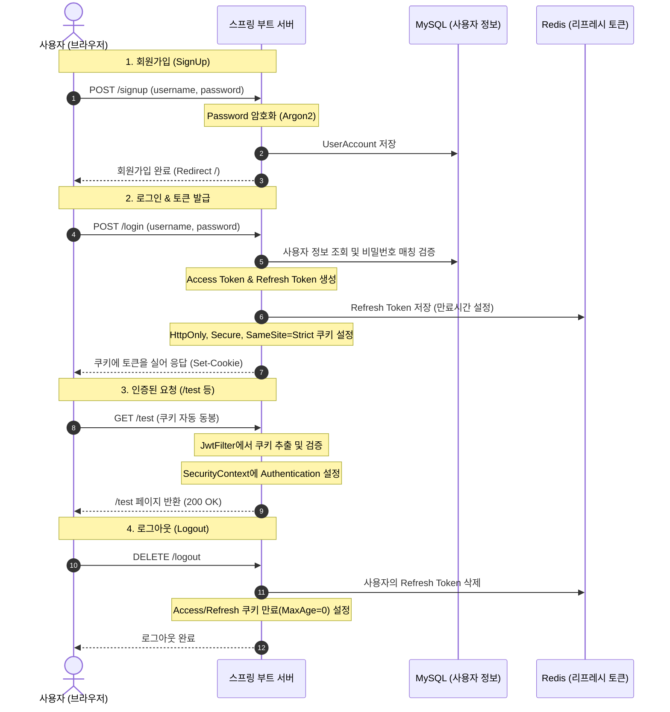

# 📝 Today I Learned (2026-08-20)

<!-- workspace-readme-learning:start -->
## 파일과 연결한 학습 안내

아래 설명은 이 폴더의 실제 소스와 빌드 설정을 기준으로 정리했습니다. 기존 소개의 기능 설명은 연결된 파일과 함께 확인할 수 있습니다.

### 주요 파일과 역할

| 파일 | 역할과 읽을 내용 |
| --- | --- |
| [build.gradle](<build.gradle>) | Gradle 플러그인·JDK·의존성과 빌드 작업 설정 |
| [src/main/java/org/example/jwtfetch/controller/AuthController.java](<src/main/java/org/example/jwtfetch/controller/AuthController.java>) | 요청 매핑·입력 바인딩과 응답 처리 — `login`, `logout` |
| [src/main/java/org/example/jwtfetch/controller/MainController.java](<src/main/java/org/example/jwtfetch/controller/MainController.java>) | 요청 매핑·입력 바인딩과 응답 처리 — `signup`, `login`, `test` |
| [src/main/java/org/example/jwtfetch/JwtFetchApplication.java](<src/main/java/org/example/jwtfetch/JwtFetchApplication.java>) | Spring Boot 애플리케이션 진입점 — `main` |
| [src/main/resources/templates/index.html](<src/main/resources/templates/index.html>) | JWT 화면 |
| [src/main/java/org/example/jwtfetch/auth/RefreshTokenRepository.java](<src/main/java/org/example/jwtfetch/auth/RefreshTokenRepository.java>) | Spring Data의 엔티티 저장·조회 계약 |
| [src/main/java/org/example/jwtfetch/domain/repository/UserAccountRepository.java](<src/main/java/org/example/jwtfetch/domain/repository/UserAccountRepository.java>) | Spring Data의 엔티티 저장·조회 계약 |
| [src/main/java/org/example/jwtfetch/service/UserAccountService.java](<src/main/java/org/example/jwtfetch/service/UserAccountService.java>) | 업무 처리와 외부 의존성 호출 — `signUp`, `login`, `TokenResult` |
| [HELP.md](<HELP.md>) | 설계·학습·운영 내용을 설명하는 문서 |
| [settings.gradle](<settings.gradle>) | 프로젝트 구성 자료 |
| [src/main/java/org/example/jwtfetch/auth/AuthCookieUtil.java](<src/main/java/org/example/jwtfetch/auth/AuthCookieUtil.java>) | Java 타입과 동작 정의 — `deleteAccessTokenCookie`, `createAccessTokenCookie`, `createRefreshTokenCookie` |
| [src/main/java/org/example/jwtfetch/auth/JwtFilter.java](<src/main/java/org/example/jwtfetch/auth/JwtFilter.java>) | Java 타입과 동작 정의 |
| [src/main/java/org/example/jwtfetch/auth/JwtProvider.java](<src/main/java/org/example/jwtfetch/auth/JwtProvider.java>) | Java 타입과 동작 정의 — `issueToken`, `parseToken`, `createRefreshToken` |
| [src/main/java/org/example/jwtfetch/auth/RefreshToken.java](<src/main/java/org/example/jwtfetch/auth/RefreshToken.java>) | Java 타입과 동작 정의 |
| [src/main/java/org/example/jwtfetch/config/AuthProperties.java](<src/main/java/org/example/jwtfetch/config/AuthProperties.java>) | 빈 등록 또는 외부 설정 구성 — `AuthProperties`, `Jwt` |
| [src/main/java/org/example/jwtfetch/config/JpaConfig.java](<src/main/java/org/example/jwtfetch/config/JpaConfig.java>) | 빈 등록 또는 외부 설정 구성 |
| [src/main/java/org/example/jwtfetch/config/SecurityConfig.java](<src/main/java/org/example/jwtfetch/config/SecurityConfig.java>) | 빈 등록 또는 외부 설정 구성 — `passwordEncoder`, `securityFilterChain` |
| [src/main/java/org/example/jwtfetch/domain/entity/BaseEntity.java](<src/main/java/org/example/jwtfetch/domain/entity/BaseEntity.java>) | Java 타입과 동작 정의 |

### 실행과 설정 확인

- [build.gradle](<build.gradle>)의 플러그인과 의존성을 기준으로 구성합니다. 선언된 Java toolchain은 17입니다.
- Windows에서는 저장소 루트에서 `.\gradlew.bat bootRun`을 사용합니다.
- 환경 설정: [src/main/resources/application-auth.yaml](<src/main/resources/application-auth.yaml>), [src/main/resources/application-db.yaml](<src/main/resources/application-db.yaml>), [src/main/resources/application.yaml](<src/main/resources/application.yaml>).
- 코드·설정에서 참조하는 환경 변수 이름: `AIVEN_MYSQL_HOST`, `AIVEN_MYSQL_NAME`, `AIVEN_MYSQL_PASSWORD`, `AIVEN_MYSQL_PORT`, `AIVEN_MYSQL_USER`, `AIVEN_REDIS_URL`, `JWT_SECRET_KEY`. 기본값과 필수 여부는 각 참조 위치에서 확인합니다.

### 관련 PDF와 보충 설명

- [7/3 강의](<../260629_ex/새 폴더/7-3/README.md>): 쿠키·세션·필터의 상태 식별과 요청 제어를 연결합니다.
- [6/1 강의](<../260629_ex/새 폴더/6-1/README.md>): HTTP 메서드·본문·응답 파싱을 실제 API 호출과 연결합니다.

이 링크는 구현을 이해하기 위한 관련 기초 자료입니다. 해당 강의가 이 저장소의 모든 기능이나 이후 버전의 API를 설명한다는 뜻은 아닙니다.

### 읽는 순서와 복습

- 로그인 상태 생성 → 세션 식별 → 공통 필터 → 접근 허용·거부를 추적합니다. 로그인 성공·실패·만료·로그아웃과 권한 없는 접근을 구분합니다.
- 요청 생성 → 상태 코드 확인 → 응답 변환 → 화면 또는 출력 반영을 추적합니다. 정상 응답, HTTP 오류, 연결 실패와 빈 응답을 구분합니다.

인증된 사용자와 요청 대상의 소유권 검사는 별개입니다. 토큰 유효성 확인 뒤 실제 권한을 검사하는 코드를 찾아 로그인·만료·접근 거부 경로를 비교합니다.

테스트 소스가 포함되어 있습니다. 이 문서 수정 작업에서는 애플리케이션·DB·외부 API 테스트를 실행하지 않았으므로 실행 결과를 보장하는 기록은 아닙니다.

<!-- workspace-readme-learning:end -->
## 주제: Spring Security + JWT + Redis Refresh Token 기반 인증 시스템 구축

오늘 실습에서는 Spring Boot와 Spring Security 환경에서 **JWT(JSON Web Token)**를 사용하고, 토큰의 한계를 보완하기 위해 **Redis 기반의 Refresh Token**을 함께 연동한 안전한 웹 인증 시스템을 구축했습니다.

---

## 📌 1. 전체 아키텍처 & 인증 흐름 (Mermaid)

---

## 📌 2. 핵심 구현 및 학습 내용

### 🛠️ 1) JPA Auditing 및 엔티티 공통화
* **[BaseEntity](<src/main/java/org/example/jwtfetch/domain/entity/BaseEntity.java>)**
  * 테이블마다 공통적으로 들어가는 고유식별자(`id`, `uuid`) 및 생성일시(`createdAt`), 수정일시(`updatedAt`)를 공통화했습니다.
  * `@MappedSuperclass` 및 `@EntityListeners(AuditingEntityListener.class)`를 사용하여 중복 코드를 제거하고 등록/수정 일시를 자동으로 기록합니다.
* **[UserAccount](<src/main/java/org/example/jwtfetch/domain/entity/UserAccount.java>)**
  * 사용자의 로그인 계정 정보를 담는 엔티티로 `BaseEntity`를 상속받아 구현했습니다.

### 🔐 2) Spring Security & Password Encoder 설정
* **[SecurityConfig](<src/main/java/org/example/jwtfetch/config/SecurityConfig.java>)**
  * JWT 기반 stateless 세션 방식을 채택함에 따라 세션을 사용하지 않도록 `SessionCreationPolicy.STATELESS`를 설정하고 CSRF, FormLogin, HttpBasic 비활성화 처리를 하였습니다.
  * 인증 없이 접근 가능한 경로(`/`, `/signup`, `/login`)를 명시하고, 그 외 요청은 모두 `authenticated()`를 통과해야 하도록 보호했습니다.
* **비밀번호 암호화**: 단방향 해시 함수 알고리즘인 **Argon2**와 **BCrypt**를 지원하는 `DelegatingPasswordEncoder`를 구축하여 비밀번호를 안전하게 암호화하여 저장했습니다.

### 🪙 3) JWT 발급 및 파싱 (`jjwt` 라이브러리)
* **[JwtProvider](<src/main/java/org/example/jwtfetch/auth/JwtProvider.java>)**
  * JWT 토큰 발급(`issueToken`) 및 서명 검증/클레임 파싱(`parseToken`)을 처리하는 핵심 컴포넌트입니다.
  * 유출을 대비하여 JWT 서명용 비밀키(`JWT_SECRET_KEY`)는 환경변수화하여 관리하도록 설계했습니다.

### 🍪 4) 보안 강화를 위한 Cookie 기반 토큰 저장
* **[AuthCookieUtil](<src/main/java/org/example/jwtfetch/auth/AuthCookieUtil.java>)**
  * 기존 브라우저의 로컬 스토리지(`localStorage`)는 JavaScript로 접근이 가능하여 **XSS(교차 사이트 스크립팅) 공격**에 노출될 위험이 큽니다.
  * 이를 보완하기 위해 쿠키 옵션을 설정해 발급했습니다:
    * **`httpOnly(true)`**: 자바스크립트로 쿠키 조회를 불가능하게 만들어 XSS 방지.
    * **`secure(true)`**: HTTPS 통신 연결망에서만 쿠키가 전송되도록 제한. (로컬 개발 단계에서는 `localhost` 이외의 도메인에서 쿠키 전송이 차단될 수 있으므로 주의해야 함)
    * **`sameSite("Strict")`**: 크로스 사이트 요청 위조(CSRF) 공격 방지.

### 🔍 5) 인증 필터 구현 (`JwtFilter`)
* **[JwtFilter](<src/main/java/org/example/jwtfetch/auth/JwtFilter.java>)**
  * 모든 HTTP 요청 전 단계에서 토큰 검증을 수행하기 위해 `OncePerRequestFilter`를 구현했습니다.
  * HTTP 요청에 포함된 쿠키들을 순회하여 `accessToken`을 추출하고, 토큰이 유효한 경우 사용자명(Subject)을 추출해 `SecurityContext`에 `UsernamePasswordAuthenticationToken`을 심어 스프링 시큐리티가 인증된 사용자로 인지하도록 만듭니다.

### 💾 6) Redis를 활용한 Refresh Token 관리
* **설정 및 엔티티 구현**
  * Access Token의 유효 기간을 짧게(예: 5분) 잡았을 때 발생하는 불편함을 해소하기 위해, 유효 기간이 긴 Refresh Token을 함께 도입했습니다.
  * 속도가 빠르고 TTL(만료 시간 지정) 설정이 편리한 **Redis**를 토큰 저장소로 활용했습니다.
  * `@RedisHash`를 활용해 만료 시간이 지나면 자동으로 데이터가 소멸하게 함으로써 메모리를 효율적으로 관리하게 했습니다.
* **로그아웃 처리 고도화**
  * 로그아웃 요청 시 브라우저 쿠키를 삭제하고, Redis에 저장된 해당 사용자의 모든 액티브 리프레시 토큰을 완전히 지워 세션을 강제 종료 처리했습니다.

---

## 📌 3. 로컬 환경 테스트 시 주의사항 (Troubleshooting)

1. **`JWT_SECRET_KEY` 환경변수 필수 설정**
   * 프로젝트 실행을 위해서는 [`.env`](<.env>) 파일에 HMAC-SHA 알고리즘 규격(최소 256비트 = 32바이트 이상)을 만족하는 `JWT_SECRET_KEY`를 필수로 주입해야 합니다.
2. **`secure(true)` 쿠키 제한**
   * 로컬 개발을 위해 HTTP 통신(`http://localhost:8080`)으로 연결할 경우, 크롬 외에 특정 브라우저에서는 `secure(true)` 설정으로 인해 로그인 후 발급된 토큰 쿠키가 브라우저에 저장되지 않는 문제가 발생할 수 있습니다. 
   * 로컬에서 원활히 테스트하려면 [AuthCookieUtil.java](<src/main/java/org/example/jwtfetch/auth/AuthCookieUtil.java#L19>)에서 임시로 `.secure(false)`로 설정해 볼 수 있습니다.

<!-- pdf-til-supplement:start -->
## TIL 부연 설명 — PDF와 연결하기

기존 실습 내용을 이해하기 위한 PDF 기반 부연 설명이다. 아래 예시는 개념을 설명하기 위한 것이며, 이 프로젝트에서 실행해 관찰한 결과와는 구분한다. 페이지 번호는 표지를 포함한 PDF 순서다.

함께 읽을 파일: [src/main/java/org/example/jwtfetch/controller/AuthController.java](<src/main/java/org/example/jwtfetch/controller/AuthController.java>) · [src/main/java/org/example/jwtfetch/controller/MainController.java](<src/main/java/org/example/jwtfetch/controller/MainController.java>) · [src/main/java/org/example/jwtfetch/JwtFetchApplication.java](<src/main/java/org/example/jwtfetch/JwtFetchApplication.java>)

**현재 실습과 연결:** 현재 JwtFilter의 refreshAuth는 refreshToken 쿠키를 검증하고 Redis에서 jti의 존재를 확인한 뒤 새 accessToken 쿠키와 인증 객체를 만든다. 이 메서드에는 이전 Refresh Token을 소비하고 교체하는 회전 과정이 없으므로 아래 회전 설명은 확장 학습에 해당한다. extractToken의 Bearer 분기는 !StringUtils.hasText(token)일 때 반환하도록 되어 있어, 정상 헤더를 처리하는 교안의 의도와 현재 조건을 구분해 읽어야 한다.

### 토큰 저장 위치와 전송 방식을 분리하기

토큰을 어디에 보관하는지와 요청에 어떻게 실어 보내는지는 별도 선택이다. localStorage는 자바스크립트에서 읽을 수 있어 XSS가 발생하면 토큰도 노출될 수 있다. HttpOnly 쿠키는 직접 읽기를 막지만 XSS 자체나 자동 전송을 이용한 요청까지 모두 막는 것은 아니다.

**예시로 이해하기:** 일반 텍스트 출력은 textContent 또는 템플릿 이스케이프를 사용한다. 401을 받았을 때 인증 갱신이 필요한지 판단하고, 403은 권한 문제로 구분한다. 저장소에서 토큰을 지우는 클라이언트 로그아웃과 서버에서 자격 증명을 무효화하는 일은 다르다.

근거: 424-2 JWT 토큰 저장 전략과 XSS 방어 — [7쪽](<../260629_ex/새 폴더/8-18/424-2_JWT_토큰_저장_전략과_XSS_방어.pdf#page=7>) · [9쪽](<../260629_ex/새 폴더/8-18/424-2_JWT_토큰_저장_전략과_XSS_방어.pdf#page=9>) · [17쪽](<../260629_ex/새 폴더/8-18/424-2_JWT_토큰_저장_전략과_XSS_방어.pdf#page=17>) · [20쪽](<../260629_ex/새 폴더/8-18/424-2_JWT_토큰_저장_전략과_XSS_방어.pdf#page=20>) · [21쪽](<../260629_ex/새 폴더/8-18/424-2_JWT_토큰_저장_전략과_XSS_방어.pdf#page=21>) · [33쪽](<../260629_ex/새 폴더/8-18/424-2_JWT_토큰_저장_전략과_XSS_방어.pdf#page=33>)

### Access Token과 Refresh Token의 수명 나누기

Access Token은 API 접근에, Refresh Token은 새 접근 토큰 발급에 사용한다. 서버가 Refresh Token의 식별자와 상태를 저장하면 유효한 갱신 요청인지 통제할 수 있다. Redis의 TTL은 저장 항목의 수명을 제한하며 JWT의 만료 검증과 함께 맞추어야 한다.

**예시로 이해하기:** 갱신 토큰을 일반 API 인증에 사용하지 못하도록 토큰 용도를 검증한다. 로그인에서 두 토큰을 발급하더라도 각각의 저장 위치와 전송 경로는 다를 수 있다. Redis에서 갱신 정보를 지운다고 이미 발급된 Access Token이 자동으로 사라지는 것은 아니다.

근거: 425-1 Refresh Token과 Redis 기반 토큰 저장소 — [14쪽](<../260629_ex/새 폴더/8-19/425-1_Refresh_Token과_Redis_기반_토큰_저장소.pdf#page=14>) · [15쪽](<../260629_ex/새 폴더/8-19/425-1_Refresh_Token과_Redis_기반_토큰_저장소.pdf#page=15>) · [16쪽](<../260629_ex/새 폴더/8-19/425-1_Refresh_Token과_Redis_기반_토큰_저장소.pdf#page=16>) · [33쪽](<../260629_ex/새 폴더/8-19/425-1_Refresh_Token과_Redis_기반_토큰_저장소.pdf#page=33>) · [38쪽](<../260629_ex/새 폴더/8-19/425-1_Refresh_Token과_Redis_기반_토큰_저장소.pdf#page=38>) · [47쪽](<../260629_ex/새 폴더/8-19/425-1_Refresh_Token과_Redis_기반_토큰_저장소.pdf#page=47>)

### 토큰 회전과 재발급의 동시성

토큰 회전은 갱신에 성공한 토큰을 폐기하고 새 갱신 토큰을 발급하는 방식이다. 같은 이전 토큰이 다시 들어오면 재사용 가능성을 판단할 수 있지만 여러 탭의 동시 갱신과 공격을 구분하는 정책도 필요하다. 이전 토큰 확인·소비가 경쟁하지 않도록 원자적 처리가 중요하다.

**예시로 이해하기:** 여러 API가 동시에 401을 받으면 클라이언트에서 하나의 갱신 작업을 공유하고 원 요청 재시도를 제한한다. 갱신 API 자체가 또 갱신을 호출하는 무한 루프를 막는다. Access Token 즉시 차단이 필요하면 남은 만료 시간과 연계한 서버 상태 관리가 추가된다.

근거: 425-2 토큰 회전과 자동 재발급 — [7쪽](<../260629_ex/새 폴더/8-19/425-2_토큰_회전과_자동_재발급.pdf#page=7>) · [8쪽](<../260629_ex/새 폴더/8-19/425-2_토큰_회전과_자동_재발급.pdf#page=8>) · [14쪽](<../260629_ex/새 폴더/8-19/425-2_토큰_회전과_자동_재발급.pdf#page=14>) · [19쪽](<../260629_ex/새 폴더/8-19/425-2_토큰_회전과_자동_재발급.pdf#page=19>) · [20쪽](<../260629_ex/새 폴더/8-19/425-2_토큰_회전과_자동_재발급.pdf#page=20>) · [29쪽](<../260629_ex/새 폴더/8-19/425-2_토큰_회전과_자동_재발급.pdf#page=29>) · [30쪽](<../260629_ex/새 폴더/8-19/425-2_토큰_회전과_자동_재발급.pdf#page=30>)

### CORS는 브라우저의 응답 접근 규칙

출처는 scheme·host·port의 조합이다. CORS는 브라우저가 다른 출처의 응답을 자바스크립트에 공개해도 되는지 판단하도록 서버가 허용 정보를 보내는 방식이며 사용자 인증을 대신하지 않는다. 일부 요청은 실제 요청 전에 OPTIONS 사전 요청으로 허용 여부를 확인한다.

**예시로 이해하기:** 터미널 요청은 성공하고 브라우저에서 실패한다면 사전 요청과 응답 헤더를 확인한다. 쿠키를 사용하는 교차 출처 요청은 클라이언트의 credentials 설정과 서버의 명시적 출처 허용이 함께 필요하다. 단순 요청은 서버에 도달한 뒤 응답 읽기만 차단될 수도 있다.

근거: 422 CSR 연동과 CORS — [14쪽](<../260629_ex/새 폴더/8-14/422_CSR_연동과_CORS.pdf#page=14>) · [18쪽](<../260629_ex/새 폴더/8-14/422_CSR_연동과_CORS.pdf#page=18>) · [23쪽](<../260629_ex/새 폴더/8-14/422_CSR_연동과_CORS.pdf#page=23>) · [24쪽](<../260629_ex/새 폴더/8-14/422_CSR_연동과_CORS.pdf#page=24>) · [28쪽](<../260629_ex/새 폴더/8-14/422_CSR_연동과_CORS.pdf#page=28>)

<!-- pdf-til-supplement:end -->
