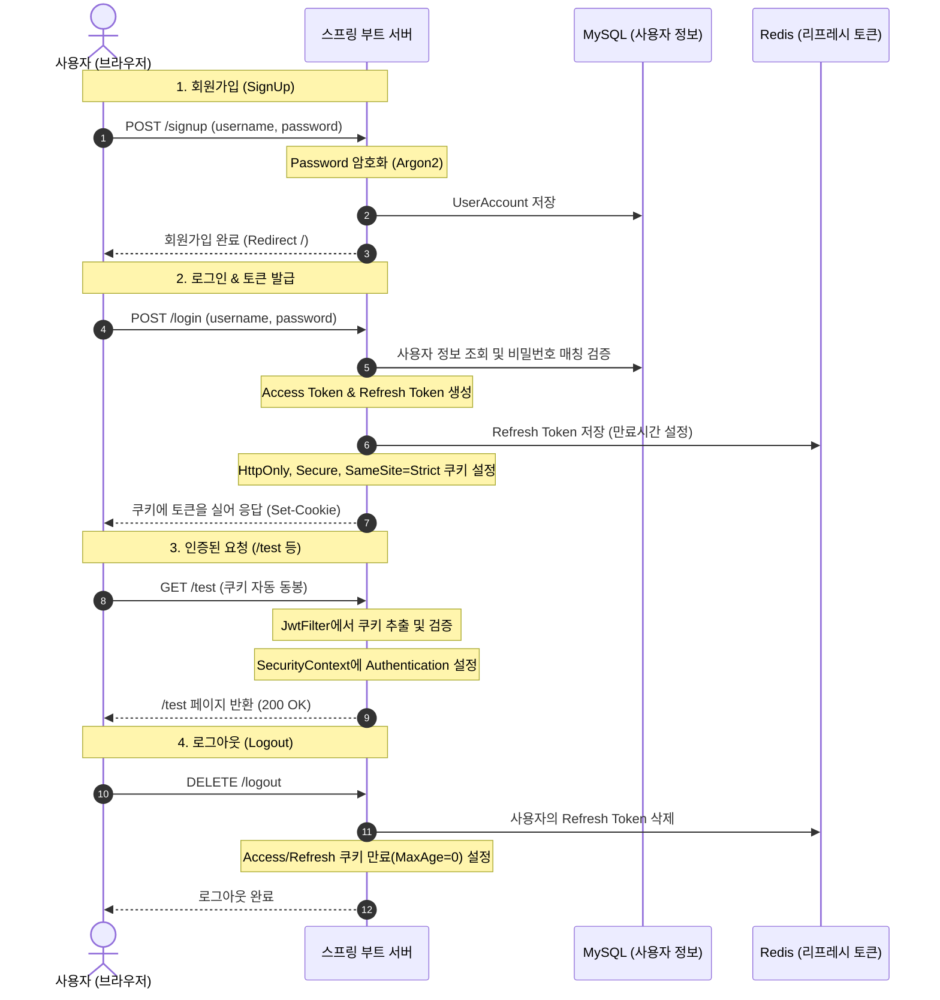

# 📝 Today I Learned (2026-08-20)
## 주제: Spring Security + JWT + Redis Refresh Token 기반 인증 시스템 구축

오늘 실습에서는 Spring Boot와 Spring Security 환경에서 **JWT(JSON Web Token)**를 사용하고, 토큰의 한계를 보완하기 위해 **Redis 기반의 Refresh Token**을 함께 연동한 안전한 웹 인증 시스템을 구축했습니다.

---

## 📌 1. 전체 아키텍처 & 인증 흐름 (Mermaid)

---

## 📌 2. 핵심 구현 및 학습 내용

### 🛠️ 1) JPA Auditing 및 엔티티 공통화
* **[BaseEntity](file:///C:/workspace/jwt-fetch/src/main/java/org/example/jwtfetch/domain/entity/BaseEntity.java)**
  * 테이블마다 공통적으로 들어가는 고유식별자(`id`, `uuid`) 및 생성일시(`createdAt`), 수정일시(`updatedAt`)를 공통화했습니다.
  * `@MappedSuperclass` 및 `@EntityListeners(AuditingEntityListener.class)`를 사용하여 중복 코드를 제거하고 등록/수정 일시를 자동으로 기록합니다.
* **[UserAccount](file:///C:/workspace/jwt-fetch/src/main/java/org/example/jwtfetch/domain/entity/UserAccount.java)**
  * 사용자의 로그인 계정 정보를 담는 엔티티로 `BaseEntity`를 상속받아 구현했습니다.

### 🔐 2) Spring Security & Password Encoder 설정
* **[SecurityConfig](file:///C:/workspace/jwt-fetch/src/main/java/org/example/jwtfetch/config/SecurityConfig.java)**
  * JWT 기반 stateless 세션 방식을 채택함에 따라 세션을 사용하지 않도록 `SessionCreationPolicy.STATELESS`를 설정하고 CSRF, FormLogin, HttpBasic 비활성화 처리를 하였습니다.
  * 인증 없이 접근 가능한 경로(`/`, `/signup`, `/login`)를 명시하고, 그 외 요청은 모두 `authenticated()`를 통과해야 하도록 보호했습니다.
* **비밀번호 암호화**: 단방향 해시 함수 알고리즘인 **Argon2**와 **BCrypt**를 지원하는 `DelegatingPasswordEncoder`를 구축하여 비밀번호를 안전하게 암호화하여 저장했습니다.

### 🪙 3) JWT 발급 및 파싱 (`jjwt` 라이브러리)
* **[JwtProvider](file:///C:/workspace/jwt-fetch/src/main/java/org/example/jwtfetch/auth/JwtProvider.java)**
  * JWT 토큰 발급(`issueToken`) 및 서명 검증/클레임 파싱(`parseToken`)을 처리하는 핵심 컴포넌트입니다.
  * 유출을 대비하여 JWT 서명용 비밀키(`JWT_SECRET_KEY`)는 환경변수화하여 관리하도록 설계했습니다.

### 🍪 4) 보안 강화를 위한 Cookie 기반 토큰 저장
* **[AuthCookieUtil](file:///C:/workspace/jwt-fetch/src/main/java/org/example/jwtfetch/auth/AuthCookieUtil.java)**
  * 기존 브라우저의 로컬 스토리지(`localStorage`)는 JavaScript로 접근이 가능하여 **XSS(교차 사이트 스크립팅) 공격**에 노출될 위험이 큽니다.
  * 이를 보완하기 위해 쿠키 옵션을 설정해 발급했습니다:
    * **`httpOnly(true)`**: 자바스크립트로 쿠키 조회를 불가능하게 만들어 XSS 방지.
    * **`secure(true)`**: HTTPS 통신 연결망에서만 쿠키가 전송되도록 제한. (로컬 개발 단계에서는 `localhost` 이외의 도메인에서 쿠키 전송이 차단될 수 있으므로 주의해야 함)
    * **`sameSite("Strict")`**: 크로스 사이트 요청 위조(CSRF) 공격 방지.

### 🔍 5) 인증 필터 구현 (`JwtFilter`)
* **[JwtFilter](file:///C:/workspace/jwt-fetch/src/main/java/org/example/jwtfetch/auth/JwtFilter.java)**
  * 모든 HTTP 요청 전 단계에서 토큰 검증을 수행하기 위해 `OncePerRequestFilter`를 구현했습니다.
  * HTTP 요청에 포함된 쿠키들을 순회하여 `accessToken`을 추출하고, 토큰이 유효한 경우 사용자명(Subject)을 추출해 `SecurityContext`에 `UsernamePasswordAuthenticationToken`을 심어 스프링 시큐리티가 인증된 사용자로 인지하도록 만듭니다.

### 💾 6) Redis를 활용한 Refresh Token 관리
* **설정 및 엔티티 구현**
  * Access Token의 유효 기간을 짧게(예: 5분) 잡았을 때 발생하는 불편함을 해소하기 위해, 유효 기간이 긴 Refresh Token을 함께 도입했습니다.
  * 속도가 빠르고 TTL(만료 시간 지정) 설정이 편리한 **Redis**를 토큰 저장소로 활용했습니다.
  * `@RedisHash`를 활용해 만료 시간이 지나면 자동으로 데이터가 소멸하게 함으로써 메모리를 효율적으로 관리하게 했습니다.
* **로그아웃 처리 고도화**
  * 로그아웃 요청 시 브라우저 쿠키를 삭제하고, Redis에 저장된 해당 사용자의 모든 액티브 리프레시 토큰을 완전히 지워 세션을 강제 종료 처리했습니다.

---

## 📌 3. 로컬 환경 테스트 시 주의사항 (Troubleshooting)

1. **`JWT_SECRET_KEY` 환경변수 필수 설정**
   * 프로젝트 실행을 위해서는 [`.env`](file:///C:/workspace/jwt-fetch/.env) 파일에 HMAC-SHA 알고리즘 규격(최소 256비트 = 32바이트 이상)을 만족하는 `JWT_SECRET_KEY`를 필수로 주입해야 합니다.
2. **`secure(true)` 쿠키 제한**
   * 로컬 개발을 위해 HTTP 통신(`http://localhost:8080`)으로 연결할 경우, 크롬 외에 특정 브라우저에서는 `secure(true)` 설정으로 인해 로그인 후 발급된 토큰 쿠키가 브라우저에 저장되지 않는 문제가 발생할 수 있습니다. 
   * 로컬에서 원활히 테스트하려면 [AuthCookieUtil.java](file:///C:/workspace/jwt-fetch/src/main/java/org/example/jwtfetch/auth/AuthCookieUtil.java#L19)에서 임시로 `.secure(false)`로 설정해 볼 수 있습니다.
